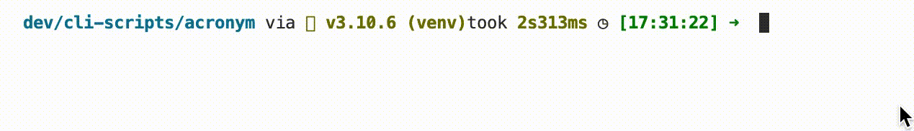

# Acronym

[](https://choosealicense.com/licenses/mit/)

The program asks the user for a sentence and returns the acronym of this sentence.

## Details:

Some little toy project. An easy project, maybe I'll look later to complexificate it.

I used this project to learn more about string manipulations


## Tools Used:


## Demo



## Installation

Install my-project with pip

```bash
  git clone git@github.com:tt-bb/cli-scripts.git
  cd cli-scripts/acronym/
  python3 main.py
```
    
## License

[MIT](https://choosealicense.com/licenses/mit/)


