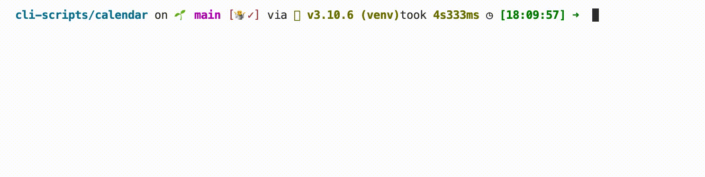

# Calendar

[](https://choosealicense.com/licenses/mit/)

A trip in the past... or in the future!

## Details:

Some little toy project: a program that asks the user for a year and a month and prints a calendar of that month. 

I used this project to learn: the module calendar, but very succint.


## Tools Used:


## Demo



## Installation

Install my-project with pip

```bash
  git clone git@github.com:tt-bb/cli-scripts.git
  cd cli-scripts/calendar/
  python3 main.py
```
    
## License

[MIT](https://choosealicense.com/licenses/mit/)
