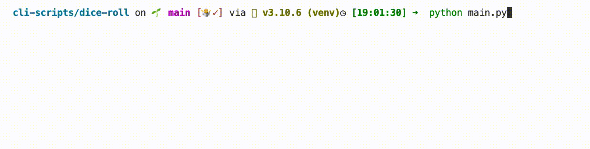

# Roll Dice

[](https://choosealicense.com/licenses/mit/)

The program asks the user for how many dice he wants to roll and prints the result in ASCII art.

## Details:

Some little toy project: some project I had fun with the ASCII part.

I used this project to learn: random and time module, functions and annotations of type.


## Tools Used:


## Demo



## Installation

Install my-project with pip

```bash
  git clone git@github.com:tt-bb/cli-scripts.git
  cd cli-scripts/dice-roll/
  python3 main.py
```
    
## License

[MIT](https://choosealicense.com/licenses/mit/)
