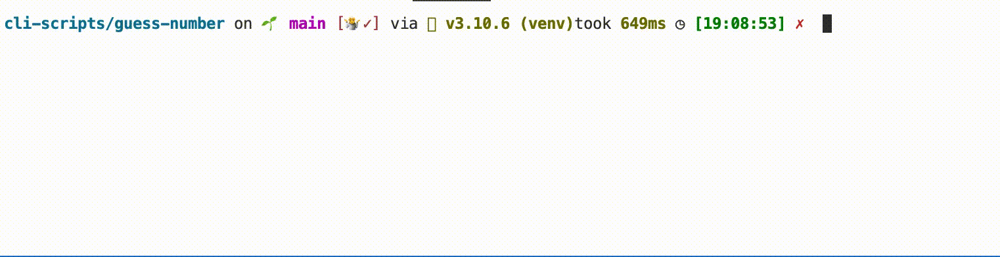

# Guess the number

[](https://choosealicense.com/licenses/mit/)

The program chose a random number and the user have to guess it.

## Details:

Some little toy project: some little game, easy to implement. 
I used this project to learn: string formating, functions and the random module


## Tools Used:


## Demo



## Installation

Install my-project with pip

```bash
  git clone git@github.com:tt-bb/cli-scripts.git
  cd cli-scripts/guess-number/
  python main.py
```
    
## License

[MIT](https://choosealicense.com/licenses/mit/)
