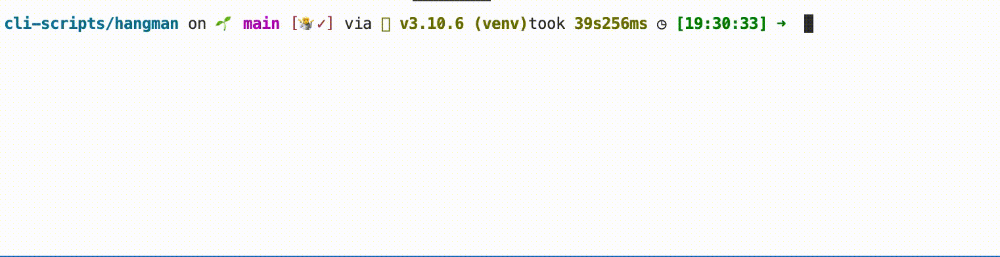

# Hangman

[](https://choosealicense.com/licenses/mit/)

Just a simple CLI hangman game.

## Details:

Some little toy project: a classic hangam 

I used this project to learn: how to import some file

## Tools Used:


## Demo



## Installation

Install my-project with pip

```bash
  git clone git@github.com:tt-bb/cli-scripts.git
  cd cli-scripts/hangman/
  python3 main.py
```
    
## License

[MIT](https://choosealicense.com/licenses/mit/)
