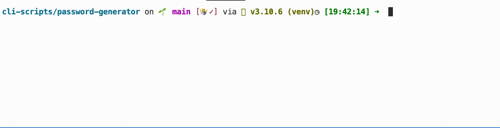

# Title

[](https://choosealicense.com/licenses/mit/)

Just a simple password

## Details:

Some little toy project: the program asks the user the lenght of its password and its complexity. 

I used this project to learn: the random and string modules and the clipboard.


## Tools Used:


## Demo



## Installation

Install my-project with pip

```bash
  git clone git@github.com:tt-bb/cli-scripts.git
  cd cli-scripts/password-generator
  pip install requirements.txt
  python3 main.py
```
    
## License

[MIT](https://choosealicense.com/licenses/mit/)
