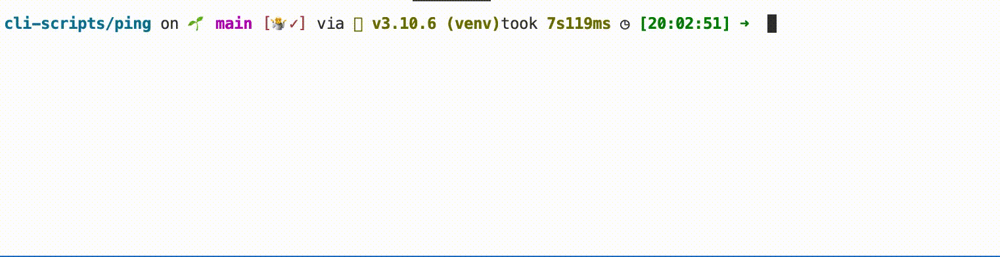

# Ping

[](https://choosealicense.com/licenses/mit/)

The program tests if a website is running or down.

## Details:

Some little toy project: an easy request module using. 
I used this project to learn: the request module


## Tools Used:


## Demo



## Installation

Install my-project with pip

```bash
  git clone git@github.com:tt-bb/cli-scripts.git
  cd cli-scripts/ping
  pip install requirements.txt
  python3 main.py
```
    
## License

[MIT](https://choosealicense.com/licenses/mit/)
