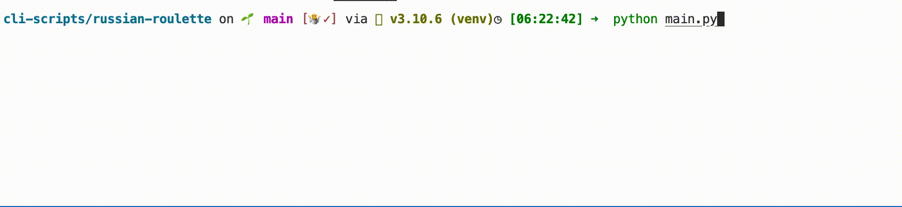

# Russian Roulette

[](https://choosealicense.com/licenses/mit/)

An implementation of the famous russian roulette.

## Details:

Some little toy project: The script asks the user the number of bullet and then, each player press `Enter` to know if he is dead or alive.

I used this project to learn: the random module and I play with user inputs.


## Tools Used:


## Demo



## Installation

Install my-project with pip

```bash
  git clone git@github.com:tt-bb/cli-scripts.git
  cd cli-scripts/russian-roulette
  python3 main.py
```
    
## License

[MIT](https://choosealicense.com/licenses/mit/)
