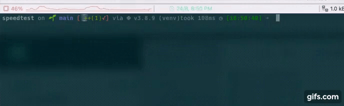

# Speedtest

[](https://choosealicense.com/licenses/mit/)

A little CLI program who prints the speed and some informations about your connection.

## Details:

Some little toy project: a speedtest who also prints some informations about your connection (IP, City, Country and ISP). 
I used this project to learn the usage of an API, here the *ipgeolocation.abstractapi.com* API.
I also learn more about Json.

## Tools Used:


## Demo



## Installation

Install my-project with pip

```bash
  git clone git@github.com:tt-bb/cli-scripts.git
  cd cli-scripts/speedtest
  pip install requirements.txt
  python3 main.py
```

### API

- Get an API key on [abstractapi.com](https://app.abstractapi.com/api/ip-geolocation/)
- Create a filename `.env`

```python
API_KEY = "your_api_key"
```
    
## License

[MIT](https://choosealicense.com/licenses/mit/)


