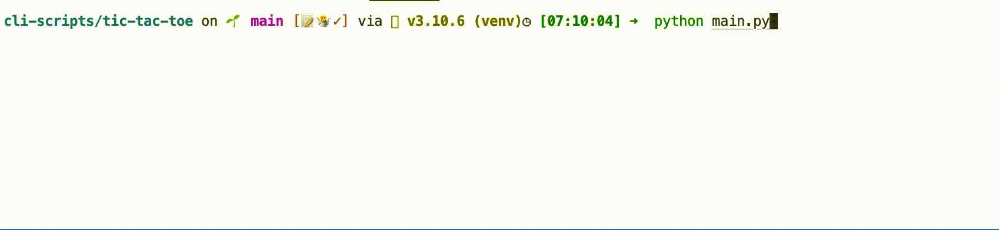

# Title

[](https://choosealicense.com/licenses/mit/)

This is a working CLI version of the famous Tic-Tac-Toe.

## Details:

Some little toy project. 

I used this project to learn: the use of functions, string manipulations and formating. I improve my logic too.


## Tools Used:


## Demo



## Installation

Install my-project with pip

```bash
  git clone git@github.com:tt-bb/cli-scripts.git
  cd cli-scripts/tic-tac-toe
  python3 main.py
```
    
## License

[MIT](https://choosealicense.com/licenses/mit/)
